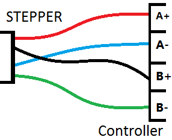
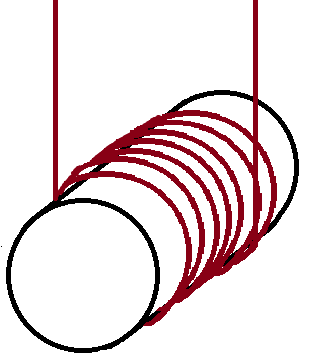
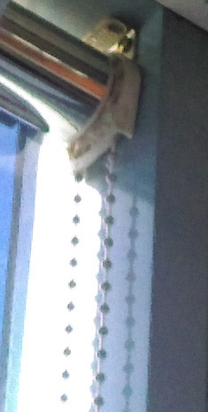
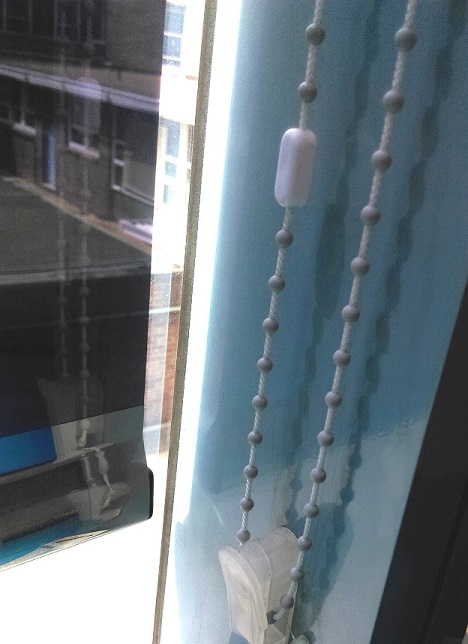
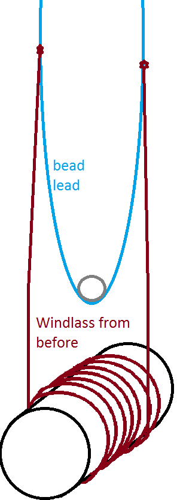

# Automatic Blinds Opener
Let the power of the sun encourage you to get out of bed each morning with this curtain/blinds opener. We’ve made a little motor/solar panel combo that will automatically open your blinds at sunrise and close at sunset. We've also included a remote so you can open and shut them whenever you want.

_Warning, this project is designed to attach and operate on your blind system, and as such, could possibly run the blinds too far and damage them without proper testing and calibration. Jaycar accepts no responsibility for what you do with your own blinds._

_Remember to test first, and test often, while developing before you attach to your working blinds._

## Bill of Materials
| Qty | Product | Description |
| :------------- | :------------- | ---- |
|1 | [YM2756](http://jaycar.com.au/p/YM2756) | NEMA stepper motor|
|1 | [XC4427](http://jaycar.com.au/p/XC4427) | Infra-red receiver module|
|1 | [XC3718](http://jaycar.com.au/p/XC3718) | IR Remote|
|1 | [XC4428](http://jaycar.com.au/p/XC4428) | RGB LED module|
|1 | [ZM9015](http://jaycar.com.au/p/ZM9015) | 1.5V Solar panel|
|1 | [XC4492](http://jaycar.com.au/p/XC4492) | Stepper motor controller  |
| 1| [XC4430](http://jaycar.com.au/p/XC4430) | Duinotech Leonardo |

Our prototype from the picture also had the following, but you can use any case to fit it in:

| Qty | Product | Description |
| :------------- | :------------- | ---- |
|1 | [HB6216](http://jaycar.com.au/p/HB6216) | Enclosure |
|1 | [WC6028](http://jaycar.com.au/p/WC6028) | Jumper leads |

## Software

| Library | Author | Version |
| :------------- | :------------- | --- |
| AccelStepper | Mike McCauley | 1.58.0 |
| IRremote | shirriff | 2.2.3 |

* Also be sure to download the [XC3718 codes helper]()

## Connection Table

| Leonardo | Connection | Device |
| --- | --- | --- |
| 2 | IN1 | Motor Controller |  
| 3 | IN2 | Motor Controller |
| 4 | IN3 |  Motor Controller |
| 5 | IN4 |  Motor Controller |
| 5V | +5V | Motor Controller |
| GND | GND| Motor Controller |
|A1 | S | IR Module |
|GND | - | IR Module |
| A0 | + | Solar panel |
| GND | - |  Solar panel |
|13 | R| RGB LED module |
|12 | G|  RGB LED module |
|11 | B|  RGB LED module |
|GND | - | RGB LED module |

## Assembly

This project is a lot more free-form than other projects, as you've got to set it up to connect to your own home blinds.

#### Stepper motor controller.
The stepper motor can be tricky to debug, so connect it up first and make sure that it operates normally.

looking directly at your stepper motor, you can see the 4 wires going left to right, what you want to do is connect them to MOTORA and MOTORB ( + and - ) for both, with the outside ones connecting directly and the inside ones crossed over.

Use the `File->Examples->AccelStepper->Bounce` should provide an easy way to test and make sure that it works correctly. Best case if you wire it wrong, is that it will spin the opposite way. If it doesn't spin at all, is weak, or just sits and vibrates, then you've got something wrong with the wiring, so double check the connections.

#### IR Receiver

Find a way to mount the IR receiver away from sunlight and so you can point the remote right to it. Thankfully due to the `XC3718_codes.h` file, it will not decode and try to run a faulty signal if it gets an interrupted source of IR such as from bouncing off the wall or etc.

#### Solar panel and RGB LED

These should be fairly obvious where to mount. RGB status LED is to indicate to you what it is doing, so you can have it fairly front-facing, or even try to diffuse the brightness with a panel or something so you can get a dulled status bulb.

The solar panel should be in direct sunlight, and will need to have leads soldered to it.

#### Connections to Blinds

Connection to blinds is probably the most difficult and "creative" part of this, as you've got to find a way to interface and everyone's set up is a little different. (_if you manage to finish the project and connect it to your blinds, send us a picture to github@jaycar.com.au so we can show it off!_)

Here's a few ideas to get you started:

* **Windlass** mechanism is often used in boats:

Using a large diameter barrel, you can wound a string around so that both ends of the string are coming out of the barrel, then when the barrel turns, it will pull on one side while giving slack to the other. This is perfect for tying string to the blinds if you do not want to deconstruct the mechanism on your blinds already.

* **Aluminum Hub** [YG2784](https://jaycar.com.au/p/YG2784)

You can use a hub to attach to the spindle of the stepper motor, and interface between either the Windlass barrel above, or connect to the spindle of the base of the rotary system, depending on what your set up is.

_It's possible to mount the stepper motor ABOVE the blinds, and interface to the spindle shown in the picture above, through either a belt-drive or direct attachment_

_Another location to place it, placing a bottle-cap or gear set to the plastic mounting so it can move the bead-lead. My blinds at home actually have a rotary attachment, so a great idea would be to mount the hub YG2784 straight to it._

_Windlass idea. this is a great way to have non-destructive attachment to your blinds system, as it adds another element which can act as a failsafe._

## Programming

There is quite a few parameters that need to be calibrated, they are all in `config.h` with comments on how to use them.

## Use

The RGB LED will indicate what state and status of the machine is in.
* Red flash - no home location, will not operate Blinds, needs to be homed.
* Green solid - all ok
* blue flashing - operating Blinds
  * fast flash - opening/closing
  * slow flash - incremental opening.

To home the machine, bring it to a fully closed position and press `channel`
